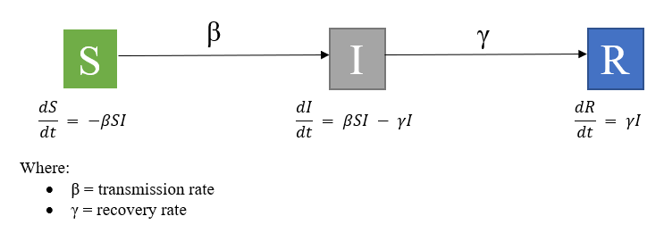
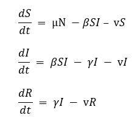

# Infectious Disease Modelling
An introduction to infectious disease modelling including projects from POPM*6950, an elective of the Master of Bioinformatics (MBINF.) program at the University of Guelph. The objective of this course is to critically appraise published mathematical models, and to build, parameterize, and analyze compartmental models.

A simple epidemiological model includes:
- (S) = The number of people that are susceptible
- (I) = The number of people that are infected
- (R) = The number of people that are recovered

This model can further be modified to include interventions (i.e., vaccination, quarantine), age-related effects, waning immunity, and stochastic effects. 

The parameters for a simple SIR model include:
- Beta (β) = number of contacts per day (c) * probability of transmission per contact (p)
- D = duration of infectiousness
  - 1/D is when D is changed to a rate (i.e., D = 6 therefore 1/D =0.167)
  - Gamma (γ) = 1/D
  
  The equations for a simple SIR model are:

  
The basic SIR can also be differentiated based on an open or closed system. The above figure is an SIR model without vital dynamics, where it is a closed population with no births or deaths. 

An SIR model with vital dynamics includes births and deaths.
- Mu (μ) = birth rate
- Nu (ν) = death rate

The equations for an open SIR model are:

There is basic code for SIR models that can be modified further and all works in this repository are done in R.
